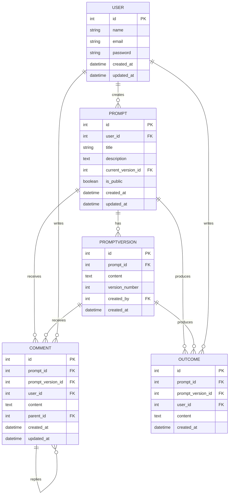

# Prompt View App – Architecture

## Overview

The Prompt View App is a Laravel-based web application for managing, viewing, and collaborating on prompts. It enables users to create, share, edit, and discuss prompts, supporting versioning, comments, and outcome tracking. The architecture is designed for clarity, scalability, and maintainability, leveraging Laravel's MVC structure and best practices.

---

## Entities

### User
- Represents a registered user of the application.
- Fields: id, name, email, password, timestamps

### Prompt
- A prompt created by a user.
- Fields: id, user_id (author), title, description, current_version_id, is_public, timestamps

### PromptVersion
- Tracks versions of a prompt (edits/history).
- Fields: id, prompt_id, content, version_number, created_by (user_id), created_at

### Comment
- User comments on prompts or specific prompt versions.
- Fields: id, prompt_id, prompt_version_id (nullable), user_id, content, parent_id (nullable for threaded comments), timestamps

### Outcome
- Represents results, experiments, or outputs generated from a prompt.
- Fields: id, prompt_id, prompt_version_id (nullable), user_id, content, created_at

---

## Relationships

- **User —< Prompt**: A user can create multiple prompts.
- **Prompt —< PromptVersion**: Each prompt has multiple versions.
- **PromptVersion —< Comment**: Comments can be attached to a specific prompt version.
- **Prompt —< Comment**: Comments can also be attached directly to a prompt.
- **Comment —< Comment**: Comments can be threaded (replies).
- **Prompt —< Outcome**: Outcomes are linked to prompts.
- **PromptVersion —< Outcome**: Outcomes can be linked to a specific version.
- **User —< Comment/Outcome**: Users author comments and outcomes.

---

## Entity Relationship Diagram (ERD)

---

## Features

- **User Authentication**: Registration, login, password reset.
- **Prompt Management**: Create, view, edit, delete prompts.
- **Prompt Versioning**: Track and view history of prompt edits.
- **Commenting System**: Threaded comments on prompts and versions.
- **Outcome Tracking**: Record and display results or experiments for prompts.
- **Access Control**: Public/private prompts, ownership checks.
- **Search & Filtering**: Find prompts by title, author, tags (if implemented).
- **Notifications**: (Optional) Notify users of comments or updates.
- **API Endpoints**: RESTful API for all main entities.

---

## Laravel Components

### Models
- `User`: Represents users.
- `Prompt`: Main prompt entity.
- `PromptVersion`: Stores prompt history.
- `Comment`: Handles threaded comments.
- `Outcome`: Tracks prompt results.

### Controllers
- `PromptController`: CRUD operations for prompts.
- `PromptVersionController`: Handles version creation, retrieval.
- `CommentController`: Manages comments and replies.
- `OutcomeController`: CRUD for outcomes.
- `AuthController`: Authentication endpoints (register, login, logout).

### Migrations
- Create tables for users, prompts, prompt_versions, comments, outcomes.
- Add foreign keys and indices for relationships.

### Policies & Gates
- Authorize actions like editing/deleting prompts or comments.

### Requests (Form Requests)
- Validate incoming data for prompt, comment, and outcome operations.

### Routes
- API and web routes for all major features.
- Grouped by entity and protected by middleware where necessary.

### Middleware
- Authentication (e.g., `auth:sanctum`).
- Rate limiting.
- CORS handling.

### Views (Blade Templates)
- Prompt list, detail, edit forms.
- Version history view.
- Comments section (threaded).
- Outcome display.

### Seeders & Factories
- Generate test data for users, prompts, comments, and outcomes.

---

## Notes

- **Extensibility**: The architecture allows for future expansion, such as adding tags, likes, or advanced outcome analytics.
- **API-First**: All main operations are accessible via RESTful endpoints.
- **Security**: Sensitive actions are protected by authentication and authorization layers.

---

## Change Log

- _Initial architecture defined for the Prompt View App._